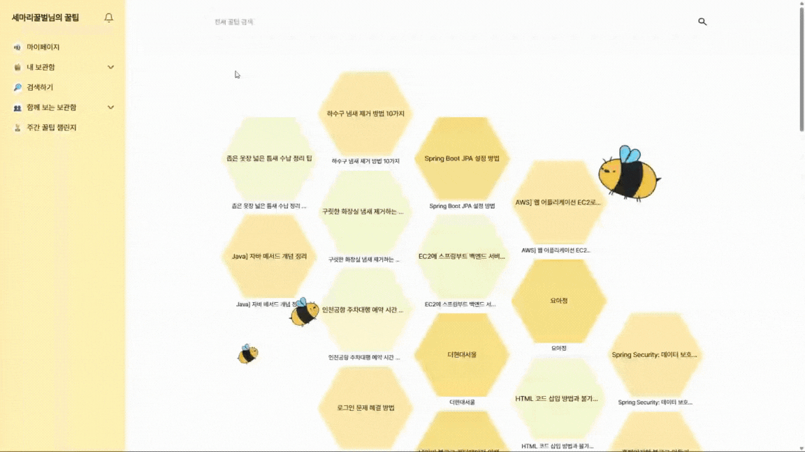
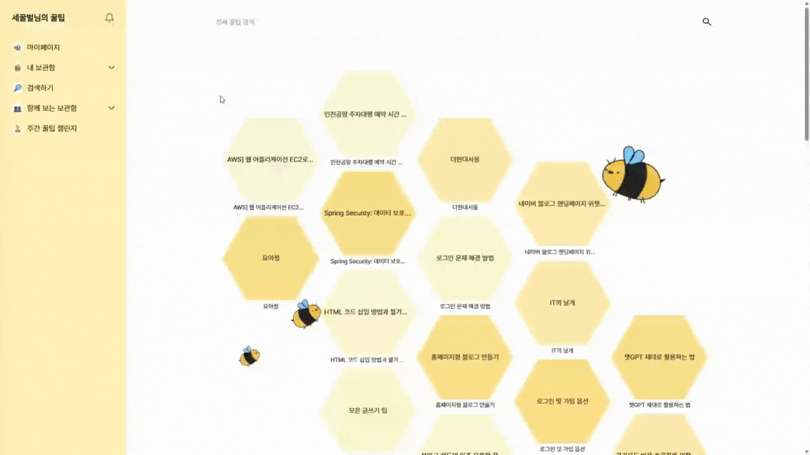

## 모꿀모꿀(MoGGulMoGGul)

  

  <h1> 모꿀모꿀 - 나만의 꿀팁 사전 서비스</h1>

  <a href="https://moggulmoggul.kro.kr">홈페이지</a>
  &nbsp; | &nbsp;
  <a href="https://www.notion.so/API-2648aa8cd0958140a4e4f5d59a636846">API 명세서</a>
  &nbsp; | &nbsp;
  <a href="https://www.notion.so/2648aa8cd0958053b77ed2507bb8941e">Notion</a>

----

## 📌 프로젝트 개요

- **프로젝트명:** 모꿀모꿀(MoGGulMoGGul)
- **프로젝트 기간:** 2025.07.01 ~ 2025.09.05
- **프로젝트 형태:** 개인 프로젝트
- **목표:** 꿀팁을 자신이 원하는 곳에 정리하고 공유하는 서비스 개발
- **주요 타겟 사용자:** 꿀팁 저장이 필요한 모든 사용자

---

## 📌 프로젝트 소개

### 📍 프로젝트 배경

정보의 바다 속에서 수많은 '꿀팁'을 발견하지만, 제대로 저장하고 관리하기는 어렵습니다. 대부분 SNS의 '좋아요'나 브라우저 북마크에 흩어져 있다가 정작 필요할 때 찾지 못하고 잊히곤 합니다. :

1. **정보 과잉과 분산:** 
   - 블로그, 유튜브, SNS 등 여러 채널에 흩어진 유용한 정보들이 파편적으로 저장되어, 필요할 때 통합적으로 찾아보기 어려움.

2. **기존 북마크 서비스의 한계:** 
   - 단순 링크 저장은 '저장' 행위에서 그침.
   - 콘텐츠의 핵심 내용을 파악하거나, 저장된 정보들 간의 연관성을 찾기 힘들어 '죽은 정보'가 되기 쉬움.

3. **정리의 비효율성:** 
   - 저장한 콘텐츠를 다시 보고, 요약하고, 태그를 다는 수동 정리 과정은 많은 시간과 노력을 요구하여 대부분의 사용자가 중도에 포기하게 됨.
   
> **모꿀모꿀**은 위 문제를 해결하기 위해 **LLM(Large Language Model)**과 **RAG(Retrieval-Augmented Generation)** 기술을 활용하여 사용자가 URL을 저장하는 즉시 **AI가 콘텐츠를 자동으로 요약·분석**하고, 개인의 지식 저장소를 넘어 커뮤니티와 연결하여 **집단 지성으로 확장되는 새로운 꿀팁 생태계**를 제공합니다.

---

### 📍 문제점 해결

- **AI 기반 자동 구조화:** URL을 저장하면 AI가 자동으로 핵심 내용을 요약하고, 관련 키워드를 추출해 태그를 생성하고, 사용자는 저장하는 것만으로 구조화된 데이터를 축적.
- **지식의 연결과 확장:** 저장된 꿀팁을 다른 사용자와 공유하고, '즐겨찾기'를 통해 집단적으로 가치 있는 정보를 선별. 개인의 지식이 커뮤니티의 자산으로 연결되고 확장되는 경험을 제공.

---

## 📌 프로젝트 목표

1. **정보 탐색 및 활용 효율 극대화:** 
   - AI 요약으로 콘텐츠의 핵심을 빠르게 파악하고 검색을 통해 즉시 정보를 찾을 수 있도록 하여 탐색 시간을 줄임.
   - '저장'이 곧 '정리'가 되는 경험을 통해 지식 재활용률을 높임.

2. **지속 가능한 지식 관리 경험 제공:** 
   - 직관적이고 창의적인 카드뷰 UI, 주간 랭킹 시스템 등을 통 사용자가 꾸준히 자신의 지식 아카이브를 관리하고 참여하도록 동기를 부여합니다

3. **개인 지식 저장소를 넘어 커뮤니티로 확장:** 
   - 개인화된 꿀팁 아카이브(MVP) 구축을 시작으로, 팀이나 그룹이 함께 사용하는 '그룹 보관함', 모두가 참여하는 '공개 피드' 기능으로 발전시켜 집단 지성이 시너지를 내는 플랫폼을 구축.

---

# 📌 주요 기능

## 0. 회원가입 | 로그인

### 회원가입
- 아이디, 닉네임, 비밀번호를 사용합니다.  
- 회원가입 전에 아이디와 닉네임의 **중복 확인**이 가능합니다.

 

### 로그인
- 아이디와 비밀번호를 사용하여 로그인합니다.  
- 로그인에 성공하면 **메인 페이지로 이동**합니다.  
- **아이디 찾기** 및 **비밀번호 재설정 기능**이 포함되어 있습니다.  

## 1. 꿀팁(팁) 관리

**기능 설명**: 사용자가 URL을 통해 꿀팁을 생성하고 관리할 수 있습니다.  

### 주요 과정
1. 사용자가 **URL, 제목, 태그**를 입력합니다.  
2. **AI가 URL의 내용을 요약**하고 **썸네일 이미지를 생성**합니다.  
3. 사용자가 요약된 내용과 썸네일을 확인 후 **보관함에 저장**합니다.  

### 기술 요소
- **AI 연동**: AI 서버의 `/async-index/`와 `/task-status/` API를 사용하여 비동기적으로 요약 및 썸네일 생성을 처리합니다.  
- **수정/삭제**: 저장된 꿀팁의 제목, 요약, 태그, 공개 설정을 수정하고 삭제할 수 있습니다.  

 

 

- **꿀팁 상세 조회**: 저장된 꿀팁의 상세 정보를 조회 할 수 있습니다.

## 2. 사용자 프로필 및 팔로우

**기능 설명**: 사용자 프로필 페이지에서 프로필 정보를 확인하고 다른 사용자를 팔로우할 수 있습니다.  

### 주요 기능
- **프로필 조회**: 닉네임, 아이디, 팔로워 수, 팔로잉 수 등을 확인할 수 있습니다.
- **팔로우/언팔로우**: 버튼 클릭으로 다른 사용자를 팔로우하거나 취소할 수 있습니다.
- **팔로워/팔로잉 목록**: 팔로워 수 또는 팔로잉 수를 클릭하면 모달 창에서 목록을 확인할 수 있습니다.  

 

## 3. 보관함 및 그룹 기능

**기능 설명**: 꿀팁을 저장할 보관함을 생성하고 관리하며, 그룹을 만들어 멤버들과 보관함을 공유할 수 있습니다.  

### 주요 기능
- **개인 보관함**: 보관함 이름을 지정하여 생성, 수정, 삭제할 수 있습니다.

 

- **그룹 생성**: 그룹을 생성하고 다른 사용자를 멤버로 초대할 수 있습니다.
- **그룹 보관함**: 그룹에 속한 멤버들은 그룹 보관함에 꿀팁을 등록 및 수정, 삭제 할 수 있습니다.  

 

- **그룹 멤버 관리** : 그룹에 속한 멤버를 조회하고 사용자 아이디 검색을 통해 멤버로 초대할 수 있습니다.

## 4. 즐겨찾기 및 주간 랭킹

**기능 설명**: 꿀팁을 즐겨찾기하고, 즐겨찾기 수에 기반한 주간 랭킹을 확인할 수 있습니다.  

### 주요 기능
- **즐겨찾기**: 꿀팁을 즐겨찾기에 추가하거나 삭제할 수 있습니다.

 

 
 
- **주간 랭킹**: 꿀팁의 주간 조회수를 기반으로 랭킹을 제공합니다.  

## 5. 알림 및 검색

**기능 설명**: 팔로우하는 사용자의 활동에 대한 알림을 받고, 꿀팁을 검색할 수 있습니다.  

### 주요 기능 (알림)
- **실시간 알림**: 팔로우하는 사용자가 새 꿀팁을 등록하거나 그룹 보관함에 꿀팁이 추가되면 알림이 생성됩니다.  
- **알림 조회**: 사용자는 자신에게 온 알림 목록을 확인할 수 있습니다.  

 

 

### 주요 기능 (검색)
- **꿀팁 검색**: 공개된 꿀팁을 키워드로 검색할 수 있습니다.

---

## 📌 기술 스택

| 구분 | 기술 스택 |
|---|---|
| **프론트엔드** |          |
| **AI** |           |
| **백엔드** |      |
| **데이터베이스** |   |
| **인프라** |      |
| **협업 툴** |    |
